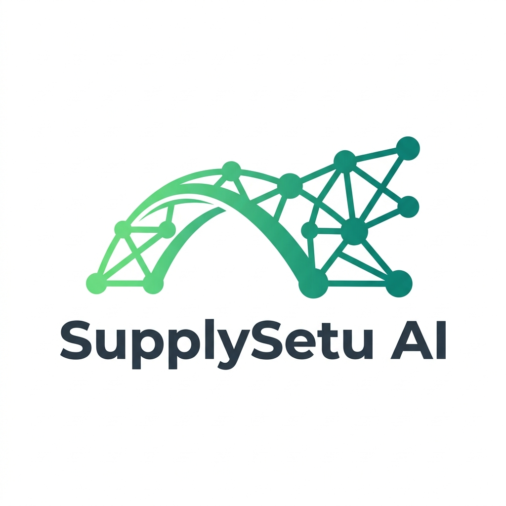

<div align="center">
  
  
  # 🚀 SupplySetu AI
  
  **Autonomous WhatsApp-Native Logistics for India's Informal Markets**
  
  [](https://fastapi.tiangolo.com/)
  [](https://nextjs.org/)
  [](https://supabase.com/)
  [](https://ollama.ai/)
</div>

---

## 🌟 The Vision

In emerging markets, B2B commerce runs on WhatsApp. Wholesalers and vendors receive hundreds of voice notes a day: *"Kal subah 20 kilo tamatar aur 15 kilo pyaz bhejna."* Processing these manually leads to missed orders, inefficient routing, and chaotic operations.

**SupplySetu AI** completely automates this. A vendor drops a voice note, and our system seamlessly transcribes the audio, extracts structured JSON data using a local LLM, plans the optimal delivery route using the Traveling Salesperson Problem (TSP) algorithm, and displays everything on a real-time command center.

Designed for the **FarAway Hackathon**, this project demonstrates how AI can formalize the informal economy with **zero variable API costs**.

---

## 🔥 Key Features

- 🎙️ **Multi-lingual Voice Order Extraction**: Using `faster-whisper` and local LLMs (`Ollama` + `Llama3`), the system perfectly transcribes and extracts structured order data from natural, multi-lingual audio.
- 🗺️ **AI Route Optimization**: We solve the Traveling Salesperson Problem using Google's **OR-Tools**. The AI calculates the absolute most efficient delivery route across all pending orders and maps it out visually on React-Leaflet.
- 📱 **Twilio WhatsApp Integration**: A built-in webhook automatically processes incoming WhatsApp text messages and voice notes via the Twilio Sandbox.
- ⏳ **Order Scrubber (Time Machine)**: Our immutable, append-only history trail captures the *intent* behind every change. Using the built-in scrubber UI, you can drag a slider to perfectly reconstruct and replay the exact state of an order at any past moment.
- 🎯 **Intent Fulfilment KPI**: The system actively holds vendors accountable to their delivery promises, automatically evaluating if a scheduled delivery was met and strictly requiring voice/text reasoning when promises are missed.
- 💸 **₹0 Operational Cost Architecture**: The core AI stack runs entirely locally using open-weights models. There are zero variable API costs—a critical requirement for low-margin logistics businesses.

---

## 💻 Technical Architecture

### Frontend (Next.js 14 App Router)
- **Styling**: Tailwind CSS + Custom Design Tokens
- **Maps**: React-Leaflet for offline-friendly routing
- **Realtime**: Supabase Realtime subscriptions

### Backend (FastAPI)
- **Database**: Supabase (PostgreSQL + Strict RLS)
- **Speech-to-Text**: `faster-whisper`
- **LLM Extraction**: `Ollama` (or Groq for instant cloud speeds)
- **Routing Engine**: `ortools` (Google OR-Tools) & `geopy`

---

## 🛠️ Ultimate Localhost Setup Guide

We built this to be robust and run locally. Follow these detailed steps to get the full SupplySetu AI experience running on your machine.

### Prerequisites (The Essentials)
1. **Node.js** (v18+) - For the frontend.
2. **Python** (3.10+) - For the backend.
3. **Ollama** installed locally (e.g., run `ollama pull llama3.2`) - For local LLM extraction.
4. **Supabase** account (Free tier is sufficient) - For DB and Realtime.
5. **FFmpeg** installed and added to your system's PATH - Required for Whisper speech-to-text.

### 1. Database Setup (Supabase)
1. Go to your Supabase project's SQL Editor.
2. Run the schema script located at `backend/db/schema.sql`. (This creates the `customers`, `orders`, `order_items`, and immutable `order_history` tables).
3. Apply the Row Level Security (RLS) policies and triggers by running `backend/db/rls.sql`. (This strictly secures the append-only history trail!).
4. Run our seeder script to populate mock data:
   ```bash
   cd backend
   python scripts/seed_db.py --force
   ```

### 2. Backend Setup (FastAPI)
Open a terminal and set up the Python environment:
```bash
cd backend
python -m venv venv

# Activate the virtual environment
# On Windows:
.\venv\Scripts\activate
# On Mac/Linux:
source venv/bin/activate

# Install the required dependencies
pip install -r requirements.txt

# Start the development server
uvicorn main:app --reload
```
*The backend will now be running on `http://localhost:8000`.*

### 3. Frontend Setup (Next.js)
Open a new terminal window and set up the Next.js app:
```bash
cd frontend
npm install
npm run dev
```
*The frontend will now be running on `http://localhost:3000`.*

### 4. Environment Configuration
Create a `.env` file in the `backend/` directory:
```env
# Judging Toggle (Set to false and provide Groq key for instant testing)
USE_LOCAL_MODEL=true
GROQ_API_KEY=

# Local Models (if USE_LOCAL_MODEL=true)
OLLAMA_BASE_URL=http://localhost:11434

# Supabase
NEXT_PUBLIC_SUPABASE_URL=https://<your-project>.supabase.co
SUPABASE_SERVICE_ROLE_KEY=<your-secret-service-key>

# Twilio Sandbox (Optional)
TWILIO_ACCOUNT_SID=
TWILIO_AUTH_TOKEN=
TWILIO_VALIDATE_SIGNATURE=false
```

Create a `.env.local` file in the `frontend/` directory:
```env
NEXT_PUBLIC_SUPABASE_URL=https://<your-project>.supabase.co
NEXT_PUBLIC_SUPABASE_ANON_KEY=<your-anon-key>
NEXT_PUBLIC_BACKEND_URL=http://localhost:8000
```

---

## 🎮 Try the Simulator!

Navigate to `http://localhost:3000/simulator` to test the complete end-to-end flow. You can use your browser's microphone to send a voice note directly into our AI pipeline, and watch the delivery routes, dashboards, and detailed history timeline update in real-time.

---

<div align="center">
  <i>Built with ❤️ for the FarAway Hackathon</i>
</div>
