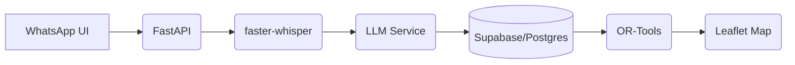

# Architecture of *SupplySetu AI* – Autonomous Order-to-Delivery Agent  

## Executive Summary  

*SupplySetu AI* is a prototype logistics platform designed for small-scale vendors to receive orders via voice (e.g. WhatsApp), automatically process them into structured orders, and optimize their delivery routes. The system streamlines the order-to-delivery workflow by integrating speech transcription, large-language-model (LLM) extraction, route optimization, and an interactive map dashboard.  The architecture uses open-source and free-tier services wherever possible to minimize cost. Key components include: a **frontend** (Next.js + Leaflet) for visualization and input, a **backend API** (FastAPI) for orchestration, an **AI pipeline** (OpenAI’s Whisper or `faster-whisper` for speech-to-text and a Gemma or GPT model for parsing orders), **Google OR-Tools** for route optimization, **Supabase** (Postgres) for data storage, and optional integration with **Twilio’s WhatsApp sandbox** for real messaging. This document details the system goals, high-level architecture, component design (with APIs and database schema), core use-case flows, technology choices, deployment strategy, and operational considerations.  

## Goals and Non-Goals  

**Goals:** The primary goal is to demonstrate a fully automated workflow from customer voice order to delivery confirmation. Specifically, the system should allow:  
- **Order Reception:** Customers (e.g. shopkeepers) send orders via voice (WhatsApp or upload) in local languages.  
- **Automatic Transcription & Extraction:** The voice is transcribed (using an on-device model like faster-whisper) and parsed by an LLM (Gemma or GPT) into structured order data (customer, items, quantities, delivery date).  
- **Order Management:** The backend records orders in a database and exposes them via APIs.  
- **Route Optimization:** Given multiple pending orders and a depot, compute an optimized delivery route using OR-Tools.  
- **User Interface:** A web dashboard (Next.js) shows incoming orders and the optimized route on a map (Leaflet + OpenStreetMap).  
- **Delivery Updates:** A user or driver can mark deliveries as complete, updating the system.  

The focus is on integrating these pieces into a cohesive end-to-end experience.  

**Non-Goals:** We explicitly exclude the following from scope:  
- **Full Inventory Management:** The system will not manage warehouse stock or handle re-ordering logic.  
- **Multi-vehicle Coordination:** The demo assumes a single delivery vehicle (expanding to fleets is out of scope).  
- **High-Volume Scaling:** The MVP is not designed for thousands of concurrent users or real-time high-frequency ordering.  
- **Offline Mode or Mobile App:** The prototype uses web technologies (no dedicated mobile apps).  

The target is a hackathon MVP – a working flow with minimal cost and maximal use of open/free tools, not a production-grade system.  

## High-Level Architecture  

The overall architecture is divided into *Frontend*, *Backend Services*, *AI Components*, *Database*, and *External Integrations*. The diagram below summarizes the major components and data flows:

```mermaid
flowchart LR
  subgraph Client
    F[Next.js UI (React, Leaflet)]
  end
  subgraph Backend
    API[FastAPI Server]
    Transcriber["Speech-to-Text (Whisper)"]
    Extractor["LLM Order Parsing (Gemma/GPT)"]
    Optimizer["OR-Tools Route Optimizer"]
  end
  DB[(Supabase Postgres DB)]
  subgraph External
    WhatsApp["WhatsApp (Twilio)"]
  end
  subgraph Hosting
    Vercel["Vercel (Frontend)"]
    Render["Render or Railway (Backend)"]
    Supa["Supabase (DB, Auth)"]
  end
  F --calls--> API
  API --read/write--> DB
  API --calls--> Transcriber
  API --calls--> Extractor
  API --calls--> Optimizer
  F --serves--> DB
  WhatsApp --webhook--> API
  API --webhook--> WhatsApp
  F --deployed_on--> Vercel
  API --deployed_on--> Render
  DB --hosted_on--> Supa
```

- **Frontend (Next.js + Leaflet):** Web UI where the vendor views incoming orders and routes on a map.  
- **Backend (FastAPI):** Central API server handling HTTP requests, orchestrating AI components and database operations.  
- **Transcription Service (Whisper):** The backend sends received audio to a speech-to-text engine (`faster-whisper`) that yields a text transcript.  
- **Order Extraction (Gemma/GPT):** The transcript is forwarded to an LLM (locally via Ollama or via OpenAI/Gemini API) to extract structured order details (e.g. items and quantities).  
- **Route Optimizer (OR-Tools):** When orders are stored, or on-demand, OR-Tools is called with a distance matrix of pending delivery locations to compute an optimal route.  
- **Database (Supabase Postgres):** Stores tables for customers, orders, and deliveries. Supabase (free tier) provides a hosted Postgres with 500 MB storage and unlimited API requests.  
- **WhatsApp (Twilio Sandbox):** For prototype, Twilio’s WhatsApp Sandbox provides an incoming webhook endpoint (with 100 free messages). The backend can receive and send WhatsApp messages via Twilio’s API.  
- **Hosting:** The frontend is deployed on Vercel (free tier for static/SSR), the backend on Render or Railway (free tier service), and Supabase hosts the database. This stack requires minimal paid resources for an MVP.  

## Component Descriptions  

### Frontend (Next.js + Leaflet)  
- **Responsibilities:** Display a dashboard of current orders and planned delivery route. Allow the user to trigger route computation and mark deliveries complete. Provide real-time updates by polling backend or using WebSockets (optional).  
- **Framework:** Next.js (React) – offers a modern web framework with server-side rendering and API route support. It integrates well with React-based components like Leaflet.  
- **Mapping:** Leaflet is used for interactive map display. Leaflet is lightweight (42 KB gzipped), open-source, and well-supported. It displays map tiles (e.g. from OpenStreetMap) and can plot markers and polylines for the route.  
- **Authentication:** If user accounts are needed, Next.js can use Supabase Auth or similar, but for an MVP, we may assume a single user or simple token.  

### Backend (FastAPI)  
- **Responsibilities:** REST API for orders and deliveries. Receives incoming WhatsApp/voice webhooks. Invokes AI services (transcription and parsing). Persists data to the database. Exposes endpoints for the frontend to fetch orders and routes.  
- **Framework:** FastAPI (Python) – a high-performance web framework for Python with automatic docs and async support. FastAPI is well-suited for building APIs quickly and scales comparably to Node.js or Go in benchmarks.  
- **Endpoints:** (see API table below) For example:  
  - `POST /api/whatsapp` – Twilio webhook for incoming messages (voice or text).  
  - `POST /api/orders` – create an order (used internally after parsing).  
  - `GET /api/orders` – list orders.  
  - `POST /api/route` – compute route for pending orders.  
  - `PUT /api/delivery/{id}` – update delivery status.  
- **Authentication:** Store Twilio API credentials and LLM API keys in environment variables. Verify Twilio signatures if desired.  

### Transcription Service (Whisper)  
- **Tool:** `faster-whisper`, an open-source reimplementation of OpenAI’s Whisper model using CTranslate2. It runs inference on CPU/GPU faster and with less memory.  
- **Justification:** `faster-whisper` can transcribe audio locally (no API cost) and is up to *4× faster than OpenAI’s original Whisper* at equal accuracy. By using int8 quantization, CPU transcription of short voice notes is feasible in real-time.  
- **Input/Output:** Accepts an audio file (WAV/MP3) from the backend (downloaded via Twilio media URL or uploaded via frontend). Outputs a text transcript.  
- **Assumption:** We assume vendor voice notes in Hindi/Marathi/English – Whisper supports multilingual input.  

### Order Extraction (LLM)  
- **Tool:** A language model like Google Gemma (open models, e.g. Gemma 3.1) or OpenAI GPT-4 via API. For cost-minimization, we plan to run **Gemma 3** locally with [Ollama](https://ollama.com), avoiding API usage costs.  
- **Justification:** Ollama + llama.cpp allows on-device inference of Gemma models on a laptop without a GPU. This means no incremental API cost per message. Gemma 3.1 (4B parameter) or Gemma 4 (2B) could parse simple orders effectively. If budget allowed, GPT-4 or Gemini via API could be used, but we aim to use freely available models.  
- **Function:** The extracted transcript (text string) is sent to the LLM prompt. The model returns a JSON-like structure containing fields like: `{ "customer": "...", "items": [{"name": "...", "qty": ...}, ...], "delivery_date": "..." }`. The backend then creates an order record from this data.  
- **Prompt Engineering:** A careful prompt template (system + user messages) will instruct the model to output valid JSON with specified fields. E.g. *“Extract products, quantities, and delivery date from the customer request.”*  

### Route Optimization (OR-Tools)  
- **Tool:** Google OR-Tools – a free, well-maintained optimization library. We use it to solve a Vehicle Routing Problem (VRP) for our delivery sequence.  
- **Justification:** OR-Tools implements VRP solvers out-of-the-box and is used in industry. It accepts a distance matrix and returns an optimal route (or near-optimal given constraints). For a single vehicle, it effectively solves a TSP. OR-Tools is Apache 2.0 licensed (no cost).  
- **Workflow:** The backend collects latitude/longitude of the warehouse (depot) and each customer’s delivery location. It constructs a distance matrix (via geodesic formulas or Google Distance Matrix API for accuracy). Then it calls OR-Tools to compute an optimal route visiting all locations. The result is returned to the frontend for display.  
- **Assumption:** We assume a single vehicle and ignore time windows or capacities for MVP. Each order is a separate stop.  

### Database (Supabase/Postgres)  
- **Service:** Supabase free tier – provides a hosted Postgres database and APIs. The free plan allows 500 MB of storage, 50,000 monthly active users, unlimited API requests.  
- **Schema:** Key tables (SQL example types):  
  - **Customers:** `(id UUID PK, name TEXT, phone TEXT, address TEXT, lat FLOAT, lng FLOAT, created_at TIMESTAMP)`  
  - **Orders:** `(id UUID PK, customer_id UUID FK, items JSONB, status TEXT, created_at TIMESTAMP)`  
  - **Deliveries:** `(id UUID PK, order_id UUID FK, route JSONB, distance FLOAT, status TEXT)`  
  - **(Optional) Vehicles:** `(id, name, capacity, etc.)` – omitted for single-vehicle assumption.  
- **Relationships:** One customer can have many orders; each order may map to a delivery schedule/route.  
- **Assumption:** For simplicity, we derive a customer’s lat/lng either from their stored profile or via geocoding their address on order.  

### External Integration (Twilio WhatsApp)  
- **Sandbox:** Twilio’s WhatsApp Sandbox for prototyping. It provides a shared WhatsApp number (`+14155238886`) that all developers use.  
- **Features:** Enables sending/receiving WhatsApp messages without business registration. Twilio trial includes 100 free WhatsApp messages. Inbound messages (or media) trigger a webhook to our backend.  
- **Limitations:** Sandbox messages are only for approved testers, have rate limits (1 message/3 seconds), and expire after 3 days. We use this only for demonstration, not production.  
- **Webhook:** Configure Twilio to call `/api/whatsapp` on the FastAPI server when a message arrives. The backend handles text or audio (download via Twilio’s media API if needed).  
- **Outbound:** The backend can reply via Twilio’s REST API, e.g. confirming order receipt or final delivery.  

### Hosting and Deployment  
- **Frontend:** Deployed to Vercel (free tier), which automatically integrates with Next.js. Offers global CDN for fast loading.  
- **Backend:** Deployed to Render.com or Railway (both have a free tier for small web services). These can run the FastAPI server and schedule background tasks (if needed).  
- **Database:** Supabase (cloud) handles hosting.  
- **Development Workflow:** Local dev uses `npm run dev` for Next.js and `uvicorn` for FastAPI. For Twilio testing, use `ngrok` or `fly.io` to expose a public HTTPS endpoint to Twilio. CI/CD (e.g. GitHub Actions) can automate testing and deployment.  

## API Endpoints  

The following table summarizes the main API endpoints, their methods, request and response schemas (JSON).  

| Endpoint           | Method | Request Payload (JSON)                        | Response                              | Description                                   |
|--------------------|--------|-----------------------------------------------|---------------------------------------|-----------------------------------------------|
| `/api/whatsapp`    | POST   | Twilio webhook payload                        | 200 OK (empty or TwiML)               | Receive WhatsApp messages (text/voice)        |
| `/api/orders`      | GET    | *(none)*                                      | `[{order}]`                           | List all orders with status                    |
| `/api/orders`      | POST   | `{ customer_id, items: [{name, qty}], date }`  | `{ id, ... }`                         | Create a new order (called by backend logic)  |
| `/api/orders/{id}` | GET    | *(none)*                                      | `{ order }`                           | Get single order by ID                         |
| `/api/route`       | POST   | `{ order_ids: [...], depot: {lat,lng} }`       | `{ route: [...latlng], distance }`    | Compute optimized route for given orders      |
| `/api/deliveries`  | GET    | *(none)*                                      | `[{delivery}]`                        | List delivery tasks (routes)                  |
| `/api/delivery/{id}` | PUT    | `{ status: "delivered" }`                    | `204 No Content`                     | Update a delivery/order as delivered          |
| `/api/geocode`     | POST   | `{ address: "..."} `                          | `{ lat, lng }`                        | (Optional) Geocode address via Nominatim      |

Additional internal endpoints (not exposed to users) may include `/api/transcribe` (to test audio transcription) or `/api/parse` for sending text to the LLM.  

## Database Schema  

Key tables and fields are summarized below (Postgres types).  

| Table      | Column        | Type         | Description                          |
|------------|---------------|--------------|--------------------------------------|
| `customers`| `id`          | `UUID` (PK)  | Unique customer ID                   |
|            | `name`        | `TEXT`       | Customer name                        |
|            | `phone`       | `TEXT`       | WhatsApp number or contact           |
|            | `address`     | `TEXT`       | Delivery address (optional)          |
|            | `lat`         | `FLOAT`      | Cached latitude                      |
|            | `lng`         | `FLOAT`      | Cached longitude                     |
|            | `created_at`  | `TIMESTAMP`  | Account creation time               |
| `orders`   | `id`          | `UUID` (PK)  | Order ID                             |
|            | `customer_id` | `UUID` (FK)  | Customer who placed the order        |
|            | `items`       | `JSONB`      | List of items `{name, qty}`          |
|            | `status`      | `TEXT`       | e.g. "pending", "delivered"          |
|            | `created_at`  | `TIMESTAMP`  | Order creation time                  |
| `deliveries` | `id`        | `UUID` (PK)  | Delivery route ID                    |
|            | `order_ids`   | `UUID[]`     | Array of orders included             |
|            | `route`       | `JSONB`      | Sequence of coordinates for route    |
|            | `distance`    | `FLOAT`      | Total distance (km)                  |
|            | `status`      | `TEXT`       | "assigned", "en route", "delivered" |
|            | `created_at`  | `TIMESTAMP`  | When route was created              |

*Assumption:* For simplicity, `orders` are delivered as they come; we may batch multiple pending orders into a single `deliveries.route`. We store the full route as an array of `{lat,lng}` points.  

## Component Responsibilities  

| Component                | Responsibilities                                                               |
|--------------------------|--------------------------------------------------------------------------------|
| **Next.js Frontend**     | Displays orders and map; calls backend APIs; handles user interactions (buttons for routing, mark delivered). |
| **FastAPI Backend**      | Orchestrates workflow: handles webhooks, calls AI modules, reads/writes DB, exposes REST APIs.             |
| **Speech Transcription** | Converts audio to text (uses `faster-whisper`).                                   |
| **LLM Order Parser**     | Extracts structured order data from text (uses Gemma/GPT via Ollama/OpenAI).    |
| **Route Optimizer (OR-Tools)** | Computes optimal delivery sequence from given locations.                    |
| **Supabase DB**          | Persists customers, orders, and delivery data; provides API and storage.         |
| **Twilio (WhatsApp)**    | Routes incoming messages to backend; can send confirmations back.                |
| **Map Service**          | (Leaflet + OSM) Renders map tiles and route on frontend.                         |

Each component uses lightweight, open-source tools to keep costs low. For example, using `faster-whisper` avoids paid speech APIs; Ollama with Gemma avoids GPT API calls; Leaflet uses free OSM tiles; Supabase’s generous free tier covers the MVP needs.  

## Core Use-Case Sequences  

### Sequence: Voice Order Processing  
```mermaid
sequenceDiagram
    participant C as Customer
    participant T as Twilio (WhatsApp)
    participant B as Backend
    participant S as Whisper
    participant L as LLM Parser
    participant D as DB
    participant F as Frontend

    C->>T: Send voice message (WhatsApp)
    T->>B: POST /api/whatsapp (media URL)
    B->>T: GET audio file URL
    B->>S: Transcribe(audio_file)
    S-->>B: Return transcript text
    B->>L: ParseTranscript(transcript)
    L-->>B: Return {customer, items, date}
    B->>D: Insert new Order & Customer
    B->>F: Notify (via WebSocket or polling)
    F-->>D: GET /api/orders
    D-->>F: Return current orders
    F: Display new order on dashboard
```
1. The **Customer** sends a voice order via WhatsApp. Twilio forwards this (webhook) to our FastAPI endpoint.  
2. The **Backend** downloads the audio, invokes **Whisper** to transcribe it into text.  
3. The **Backend** sends the transcript to the **LLM Parser**, which returns structured data (customer name, product list, etc.).  
4. The **Backend** writes the new order (and customer) to the **Database**.  
5. The **Frontend** periodically polls or subscribes to order updates, fetching `/api/orders` to display the new order.  

### Sequence: Route Optimization & Delivery  
```mermaid
sequenceDiagram
    participant U as User/Driver
    participant F as Frontend
    participant B as Backend
    participant O as OR-Tools
    participant D as DB

    U->>F: Click "Generate Route"
    F->>B: POST /api/route { order_ids, depot }
    B->>D: SELECT lat,lng of orders and depot
    D-->>B: Send location data
    B->>O: ComputeRoute(locations)
    O-->>B: Return optimized route + distance
    B-->>F: Return route JSON
    F: Plot markers & route polyline on map
    U->>F: Mark deliveries as done
    F->>B: PUT /api/delivery/{id} {status:"delivered"}
    B->>D: Update order status to delivered
    D-->>B: Confirmation
```
1. The **User** requests route computation. The **Frontend** calls `/api/route` with pending order IDs.  
2. The **Backend** queries **DB** for the coordinates of each order’s destination and the depot (warehouse).  
3. The **Backend** invokes **OR-Tools** to find the optimal visitation sequence. The result (an ordered list of locations) is returned to the frontend.  
4. The **Frontend** displays the route on a map (Leaflet polyline through the stops).  
5. After completing deliveries, the user marks them complete, and the frontend updates the **DB** via `/api/delivery/{id}`.  

## Technology Choices and Trade-offs  

- **fastAPI (Python)** – Chosen for ease of writing REST APIs with async support. It is *“modern, fast (high-performance)”*. Alternatives like Flask or Node.js exist, but FastAPI’s automatic docs and data validation (with Pydantic) are advantages.  
- **Next.js (React)** – Enables building a responsive SPA/SSR dashboard with minimal setup. It’s a de facto standard framework for React apps. Tailwind CSS (via shadcn/UI) is used for UI components (fast dev, no cost).  
- **Leaflet + OpenStreetMap** – For mapping. Leaflet is *“the leading open-source JavaScript library for mobile-friendly interactive maps”*. It is free and lightweight. Google Maps (paid) or Mapbox (limited free) were alternatives, but Leaflet/OSM avoids any API fees.  
- **Supabase (Postgres)** – Offers a generous free tier (500 MB DB, unlimited API calls). It’s open-source and well-documented. An alternative like Firebase or AWS Amplify was considered, but Supabase’s SQL support and generous free quota make it ideal for hackathon MVPs.  
- **Twilio WhatsApp Sandbox** – Simplifies WhatsApp integration (no need for official WhatsApp Business approval). The sandbox provides a temporary shared number. The trade-off is it’s only for testing and has limits (it’s explicitly *not* for production). If scale were needed, the official WhatsApp API (paid) or other messaging (SMS) would be options.  
- **Speech-to-Text:** `faster-whisper` (open source) vs external API (Azure/Google). We choose `faster-whisper` to avoid API costs. Although it requires local CPU/GPU, benchmark shows it transcribes faster than the original Whisper with less memory. We assume small audio sizes (seconds long), so latency is acceptable on a modern laptop/instance.  
- **Order Parsing (LLM):** Options: local Gemma (via Ollama) vs OpenAI/Gemini cloud APIs. For a hackathon, cost is critical. Using open-source models (Gemma 3) locally means no per-call cost. The trade-off is lower accuracy vs GPT-4; we assume order language is simple. If API access is available, GPT-4 or Gemini could improve extraction at the expense of budget.  
- **Route Optimization:** OR-Tools is free and robust. Alternative libraries (like JS implementations or using Google Maps API travel optimization) either aren’t free or are less mature. OR-Tools also allows adding capacity/time constraints later if needed.  
- **Backend Hosting:** Render or Railway free tier can run FastAPI with occasional sleep. For heavy use, one might consider AWS/GCP, but we stick to free-tier services for MVP cost-effectiveness.  
- **Assumptions:** We assume reliable Internet, minimal concurrent users (one vendor at a time), and that free tiers cover our usage. We assume GDPR/privacy rules are followed by not storing unnecessary personal data and by using TLS for all requests.  

## Deployment and Development Workflow  

- **Local Development:** Use Git/GitHub. Frontend on Node.js (`create-next-app`), backend on Python (`venv` + FastAPI). Use `npm run dev` and `uvicorn main:app`. Use the Supabase CLI or direct connections to a local Postgres for testing.  
- **Ngrok (or similar):** To receive Twilio webhooks during dev, run `ngrok http 8000` and configure Twilio sandbox webhook to ngrok’s URL.  
- **Environment Variables:** Store secrets (Twilio SID/token, Supabase keys, Ollama/Gemma config) in `.env`. Do not hard-code.  
- **Version Control:** Use Git. Code review via pull requests. Possibly include YAML config for CI (GitHub Actions) to lint/validate or deploy.  
- **Automated Deploy:** On each push to `main`, deploy frontend to Vercel and backend to Render via their Git integrations. Supabase migrations can be scripted or manually handled.  
- **Backup:** Rely on Supabase automatic daily backups (not available on free tier, but acceptable for MVP). For safety, export important data periodically or use Supabase’s GUI to copy data.  

## Security, Privacy, and Data Retention  

- **Transport Security:** All APIs and frontend served over HTTPS (Vercel/Render manage certificates). Twilio requires HTTPS webhooks.  
- **Credentials:** Store API keys and secrets only in environment variables. Use Supabase RLS (Row Level Security) if user accounts are introduced.  
- **Input Validation:** Use Pydantic models in FastAPI to validate incoming data (protect against injection).  
- **Twilio Signature:** (Optional) Verify Twilio’s X-Twilio-Signature on incoming webhooks to confirm authenticity.  
- **Data Privacy:** 
  - **Voice Data:** Transcribed text is stored; the raw audio can be discarded after transcription. We assume no need to save audio beyond initial processing to save space.  
  - **Personal Info:** Only minimal customer contact (name/number) is stored. No sensitive data (like payment info) is handled.  
  - **Retention:** For MVP, keep order history for demonstration. In a real app, implement a retention policy (e.g. delete records after 30 days). Supabase allows table archiving or deletion via SQL scripts.  
- **Compliance:** Using WhatsApp requires adhering to its messaging policies. Since we use the sandbox and only prototype, formal compliance is not addressed, but a production version would need user opt-in and GDPR considerations.  

## Performance and Scalability  

- **MVP Scale:** Expect at most tens of orders per hour. All components (Single-threaded API, moderate CPU for transcription/LLM) can handle this on a single server.  
- **Latencies:** Transcription (faster-whisper) on CPU is a few seconds for short clips. LLM parsing might be slower (depending on model size); consider asynchronous background tasks if needed. UI can show a “processing” state.  
- **Database:** The Supabase free-tier Postgres has limited RAM (shared CPU 500 MB). This suffices for small tables. For more orders, we would shard or move to a higher plan.  
- **Optimizing Routes:** OR-Tools solves TSP quickly for small N (5–10 points). For large N, solution time grows, but our demo likely ≤20 stops. For production, one could implement incremental routing or caching.  
- **Map Tiles:** Using OpenStreetMap tiles can handle thousands of requests (through Leaflet). For heavy usage, consider a paid tile service or caching.  
- **Future Scaling:** If usage grows, separate services (e.g. dedicate a GPU instance for Whisper/LLM, or scale backend instances) and use a message queue (RabbitMQ/Celery) for asynchronous tasks.  

## Testing Strategy and Observability  

- **Unit Tests:** Write pytest tests for core functions: transcription integration (simulate audio→text), LLM parser (mock API or use small model to verify JSON output), route solver (given sample coordinates, check output order).  
- **Integration Tests:** Use FastAPI’s TestClient to simulate API calls. For example, POST sample transcript to `/api/orders` and verify DB write.  
- **Webhooks:** Simulate Twilio POST by sending test JSON to `/api/whatsapp` with a test media URL (or local file) to ensure end-to-end works.  
- **Manual Testing:** For UI, verify that the map displays correctly and updates as expected. Test with sample audio in Hindi/English.  
- **Error Handling:** The backend should catch exceptions from AI (e.g. model timeout) and return appropriate HTTP errors. The UI should display error messages if endpoints fail.  
- **Logging:** Use structured logging in FastAPI (e.g. Python’s `logging` module). Log key events: new orders, errors, and API calls. For LLM or Whisper failures, log the error context.  
- **Metrics (Observability):** Track metrics like number of orders processed, transcription time, and API error rate. For a hackathon, logging to console or a simple file is sufficient. In a real system, one could integrate Grafana/Prometheus or a SaaS like Datadog.  
- **Monitoring:** Ensure backend reports health (e.g., `/health` endpoint). For Twilio, monitor message statuses via the status callback URL to detect failed deliveries.  
- **Assumption:** Given MVP scope, a formal monitoring stack is optional, but basic logging ensures visibility into failures.  

---

**References:** Official documentation and benchmarks were used to guide these choices: Supabase free tier limits; FastAPI performance characteristics; Leaflet’s description as an open-source mapping library; Google OR-Tools for VRP; Twilio WhatsApp Sandbox guidelines; faster-whisper benchmarking; and running Gemma locally via Ollama. All data models and flows above are based on these sources and standard software design practices.

# Architecture

SupplySetu’s system is centered on a **FastAPI** backend that orchestrates each step. Key components include:

- **API (FastAPI):** An async, high-performance Python web framework (built on Starlette/Pydantic) for REST endpoints. 
- **STT (faster-whisper):** On-device speech-to-text using an optimized Whisper model (low-latency transcription). 
- **NLP (LLM):** A schema-guided LLM (e.g. Gemini/GPT) that parses transcripts into structured JSON orders. 
- **Database (Supabase/Postgres):** A managed PostgreSQL database (open source). Supabase’s architecture uses a Kong API gateway and PostgREST over a single Postgres instance, providing instant RESTful storage. 
- **Routing (OR-Tools):** Google’s OR-Tools solves the vehicle routing problem using a distance matrix to find optimal delivery routes. 
- **Mapping (Leaflet):** A lightweight, open-source JS library for interactive maps (using OpenStreetMap tiles). The frontend (Next.js) displays customer markers and OR-Tools paths on a Leaflet map. 
- **Geocoding (Nominatim, optional):** The OSM-based geocoder to convert addresses to lat/lng (for building the distance matrix).

**Data flow:** A user’s voice/text order is sent to FastAPI → transcribed by Whisper → parsed by the LLM into JSON orders. Orders are saved in Postgres. When routing, addresses are (optionally) geocoded and OR-Tools computes an optimized path; the resulting waypoints are rendered via Leaflet. FastAPI provides endpoints for uploading orders, retrieving data, and triggering route calculations.



**Tech stack:** Python 3 with FastAPI; faster-whisper for STT; a cloud LLM (or open model) for parsing; Supabase (free Postgres) for storage; OR-Tools for routing; Leaflet + OpenStreetMap for UI. All components use open-source/free options (e.g. Whisper offline, free-tier DB, OSM maps) to minimize cost. References to core components are above. 

**Sources:** FastAPI docs, Supabase architecture, faster-whisper intro, LLM JSON extraction, OR-Tools VRP, Leaflet, Nominatim.