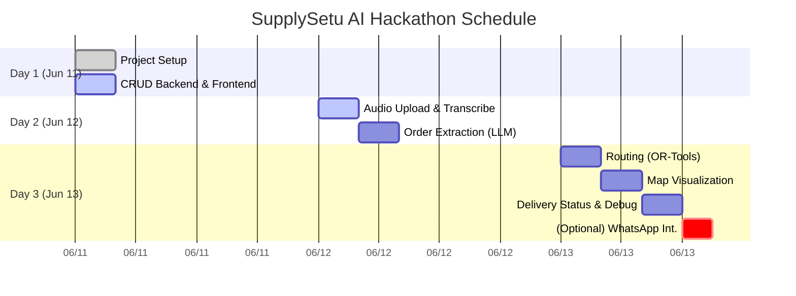

# System Architecture

SupplySetu AI is a full-stack web application integrating frontend, backend, AI, and third-party services to automate informal supply chain operations.  The **frontend** is built with Next.js (React), enabling server-side rendering (SSR) or static pages as needed.  Next.js automatically handles routing and can include API proxy routes, making it easy to fetch backend data.  The **backend** is implemented in Python using FastAPI, a high-performance web framework (comparable to Node.js/Go) that exposes RESTful API endpoints.  FastAPI uses Python type hints for automatic request validation and generates OpenAPI/Swagger docs.  

The **database** is Supabase (managed PostgreSQL) which provides an auto-generated REST API and real-time subscriptions.  Supabase’s core (Postgres + GoTrue + Realtime) runs on open-source tech, so one can self-host or use the free cloud tier.  We define relational tables (e.g. `customers`, `orders`, `order_items`, `deliveries`) in Postgres with schemas and foreign keys (see “Database Schema” below).  Supabase clients can listen for updates via real-time WebSockets (Phoenix/Elixir-based) if needed.

**AI Components:** SupplySetu AI uses local ML models: **Faster Whisper** for audio transcription and an LLM (e.g. an open-weight model like Llama or GPT/Gemini via Ollama) for order extraction.  *Faster-Whisper* is a PyPI library reimplementing OpenAI’s Whisper with CTranslate2, achieving ~4× faster transcription than the original while matching its accuracy.  FastAPI endpoints will accept uploaded voice notes and pass them to faster-whisper for transcription.  The text output is then sent to a language model (via Ollama or the OpenAI API) with a prompt to extract structured order data (customer name, items, quantities, etc.) in JSON form.  We explicitly note that **running the LLM locally (e.g. with Ollama + GPT-4o/Gemini) avoids API costs**, while cloud models (OpenAI GPT) may incur usage charges.

**Routing Engine:** Once orders and their destination addresses are in the system, we use **Google OR-Tools** to compute delivery routes.  OR-Tools is an open-source optimization library for NP-hard problems like vehicle routing.  We will model a single-vehicle or multi-vehicle routing problem by building a distance matrix between delivery locations (using geopy or simple Haversine distance).  OR-Tools will solve for the shortest path (minimizing distance or time) under simple constraints (one depot, return to depot).

**Mapping/Visualization:** The optimal route and delivery points are displayed on a map in the frontend using **Leaflet** with OpenStreetMap tiles.  Leaflet is a lightweight, open-source JS library for interactive maps.  It supports markers, popups, polylines, and is mobile-friendly.  We render delivery addresses as markers and draw the computed route as a polyline, plus basic UI (e.g. a “Mark Delivered” button per order).

**Messaging Integration (Optional):** To simulate the informal workflow, we optionally integrate with **Twilio’s WhatsApp Sandbox**.  This allows our app to send and receive WhatsApp messages without a registered business account.  The sandbox provides a shared phone number for testing; users join it via a join-code.  Incoming messages (e.g. voice notes or text orders) from WhatsApp trigger a webhook (FastAPI endpoint) in our backend, and outgoing responses use the Twilio Messaging API.

**Deployment and Data Flow:** In development, we use `sqlite` (or a local Supabase instance) and tools like `ngrok` for webhook testing.  In production or staging, the backend can be deployed on Render.com (free tier for FastAPI) or Railway, and the Next.js frontend on Vercel.  Environment variables configure credentials (Supabase URL/key, Twilio SID/token, etc.).  The overall request flow: 

1. **Order Entry:** A vendor/customer sends a message (text or voice note) via WhatsApp or a web form.  
2. **Transcription & Extraction:** FastAPI receives the voice file, uses faster-whisper to transcribe, then calls an LLM to parse the order.  The structured order (customer, items, quantities) is inserted into the database.  
3. **Storage:** Supabase stores `customers`, `orders`, and `order_items`.  For example, an order might be split into multiple rows in `order_items`.  
4. **Route Planning:** The backend queries pending orders for a given day, geocodes addresses to lat/lng (using a geocoding API or library), builds a distance matrix, and runs OR-Tools to compute an optimal route.  The resulting sequence of stops is returned to the frontend.  
5. **Visualization:** The Next.js UI fetches the route (and customer locations) and renders them on a Leaflet map, along with any relevant info (ETA, distance saved).  
6. **Delivery Status:** As drivers complete deliveries, they tap “Delivered” in the app.  The backend updates order status (and could notify customers if integrated with messaging).

**Scalability & Extensibility:** This architecture cleanly separates concerns: the Next.js frontend handles UI, FastAPI handles business logic, and Supabase handles persistence and real-time updates.  Each layer can be scaled (e.g. adding more backend workers for transcription or routing).  The choice of open-source tools (Leaflet, OR-Tools, Postgres) and free-tier services (Supabase free plan, Vercel/Render free tiers) minimizes cost.  Notably, Faster-Whisper runs locally (GPU or CPU) and the LLM model can be run via Ollama on-device, eliminating per-call charges.

**Key Technologies (with Sources):**  
- **Next.js/React:** React framework with SSR/SSG support. Enables hybrid full-stack development.  
- **FastAPI:** High-performance Python API framework with automatic OpenAPI docs.  
- **Supabase (Postgres):** Managed PostgreSQL with real-time pub/sub and autogenerated REST API.  
- **Faster-Whisper:** Open-source Whisper reimplementation (up to 4× faster).  
- **LLM (Ollama/GPT/Gemini):** For natural language extraction (on-device or via API).  
- **OR-Tools:** Google’s open-source solver for vehicle routing.  
- **Leaflet + OSM:** Interactive web maps for delivery routes.  
- **Twilio WhatsApp Sandbox:** Allows testing inbound/outbound WhatsApp messaging.  

All major components are open-source or free-tier, keeping the MVP cost minimal. Integration is done via standard REST/WebSocket APIs, making the system modular and maintainable.

# Implementation Plan

## Executive Summary

SupplySetu AI’s 3-day hackathon MVP will focus on end-to-end automation of order-to-delivery workflow via WhatsApp/voice input.  We break the plan into phases, each with clear objectives, deliverables, and estimated effort.  Day 1 builds the project skeleton (frontend, backend, DB). Day 2 adds AI (speech-to-text and NLP order extraction) and data storage. Day 3 implements optimization (OR-Tools routing) and visualization (Leaflet maps). Key features (voice input, automated parsing, routing) are prioritized.  Optional enhancements (WhatsApp sandbox, analytics) come last.  Our plan includes tables for tasks/hours, data models, API endpoints, a dev workflow, testing checklist, demo script, risk mitigation, and a 3-day timeline diagram.  

## Phase Breakdown and Task Timeline

We allocate ~3 full working days (~24–30 hours total) across phases:

| Phase               | Tasks (Key Steps)                                        | Estimated Hours |
|---------------------|----------------------------------------------------------|----------------:|
| **1: Project Setup**| Initialize code repos; scaffold Next.js front end; scaffold FastAPI backend; define DB schema and models; install core libraries (FastAPI, Next.js, Supabase client) | 6h  |
| **2: Local CRUD & UI** | Build basic UI/pages (e.g. orders dashboard); implement stub FastAPI endpoints (e.g. GET/POST orders, customers); connect frontend calls to backend; verify DB read/write via API (using SQLite or Supabase free tier) | 4h  |
| **3: Audio & Transcription** | Add file upload UI; integrate **faster-whisper** in FastAPI (file upload endpoint); test audio->text transcription; handle transcription results in backend | 4h  |
| **4: Order Extraction** | Integrate LLM (Ollama or GPT API) to parse transcripts into JSON orders; implement `/extract` endpoint; design `orders` and `order_items` tables; save structured orders in DB | 4h  |
| **5: Route Optimization** | Write endpoint `/route` that fetches pending orders, geocodes addresses (or uses pre-set lat/lng), builds distance matrix, runs **OR-Tools**; return optimized route sequence | 5h  |
| **6: Map Visualization** | Integrate Leaflet in front end; fetch route & customer coords; display map with markers and polyline route; polish UI (map legend, status) | 4h  |
| **7: Delivery Status** | Add “Mark Delivered” button per order; backend updates order/delivery status; optional notification to customer; ensure DB reflects changes | 3h  |
| **8: (Optional) WhatsApp Integration** | Configure Twilio WhatsApp Sandbox; set webhook to FastAPI; implement sending/receiving messages for orders; test end-to-end with WhatsApp | 4h  |
| **9: Testing & Polish** | Write basic tests or manual checks; fix UI bugs; add loading/error states; prepare demo data; write docs; deploy small fixes | 3h  |

*Total ~33 hours (approx 4 days), but core MVP fits in 3 days (~24h) by dropping optional tasks or overlapping.  Hours include development and brief testing; tasks may run in parallel (e.g. backlog tasks and quick UI polish).*

**Table 1. Phase breakdown with tasks and estimated effort (hours).**

## Deliverables by Phase

- **Phase 1**: Repository with Next.js & FastAPI structure; initial config (e.g. `package.json`, `requirements.txt`); Supabase/SQLite schema setup.
- **Phase 2**: Functional CRUD UI (list orders/customers), working API endpoints (e.g. `GET /orders`, `POST /customers`), data stored correctly.
- **Phase 3**: Endpoint `/transcribe` (FastAPI) accepting audio file; UI file uploader; transcribed text shown in console or UI.
- **Phase 4**: Endpoint `/extract` that calls an LLM (e.g. via `requests` to local LLM server or OpenAI) to convert transcript to JSON (customer, items); new DB tables created and populated (`orders`, `order_items`).
- **Phase 5**: Endpoint `/route` returns optimized route order for given orders; test with sample coordinates.
- **Phase 6**: Interactive map page displaying markers for each order and drawn polyline for route; orders can be filtered by date.
- **Phase 7**: UI button to update delivery status; status saved to DB; dashboard reflects completed deliveries.
- **Phase 8** (if time): Twilio integration working (joining sandbox, sending a test WhatsApp order, receiving auto-reply in system).
- **Final**: Demo data and script, error handling, basic documentation.  

## Data Models (Database Schema)

We use PostgreSQL (Supabase) with these core tables:

| Table          | Fields (Type)                                                                 |
|---------------|-------------------------------------------------------------------------------|
| **customers** | id (PK, int, auto), name (text), phone (text), address (text), lat (float), lng (float) |
| **orders**    | id (PK), customer_id (FK→customers.id), scheduled_date (date), status (text), created_at (timestamp) |
| **order_items** | id (PK), order_id (FK→orders.id), product_name (text), quantity (int)      |
| **deliveries** | id (PK), order_id (FK→orders.id), vehicle_id (int), sequence (int), delivered (bool), delivered_at (timestamp) |

Additional tables (if extended):
- **vehicles** (id, capacity, type) for multi-vehicle routing.
- **users/vendors** for auth (if needed).
- **messages** to log WhatsApp chat history.

*Table 2. Database schema for MVP tables.*

## API Endpoints

We define REST endpoints (FastAPI) and matching frontend calls:

| Method | Path               | Request (JSON or form)                            | Response (JSON)                          |
|-------|--------------------|--------------------------------------------------|------------------------------------------|
| **POST** | `/transcribe`        | Form-data: `file` (audio `.ogg/.mp3` voice note) | `{ "transcript": "..." }`                |
| **POST** | `/extract`          | `{"transcript": "...speech text..."}`            | `{ "customer":"Name","items":[{"product":"Tomato","quantity":20},... ]}` |
| **POST** | `/orders`           | `{"customer": "...", "items":[{"name":"", "qty":X}, ...]}` | `{ "order_id": 123 }`                    |
| **GET**  | `/orders`           | –                                                | `[ {id, customer, items[], status, created_at}, ... ]` |
| **GET**  | `/orders/{id}`      | –                                                | `{id, customer, items[], status, created_at}` |
| **PUT**  | `/orders/{id}`      | `{"status": "delivered"}`                        | `{ "result": "success" }`                |
| **POST** | `/route`            | `{"order_ids": [123, 124, ...]}`                | `{"route": [ depot_index, idxA, idxB, ..., depot_index ], "distance": 18.2}` |
| **GET**  | `/customers`        | –                                                | `[ {id, name, phone, address, lat, lng}, ... ]` |

Example: a POST to `/extract` with `{"transcript": "Kal subah 20 kilo tamatar..."}` should return JSON like `{"customer":"Unknown","items":[{"product":"Tomato","quantity":20}]}`.  We assume some defaults if fields (e.g., customer name) are missing.

FastAPI automatically generates OpenAPI docs for these endpoints, which is helpful for testing. 

*Table 3. Key API endpoints (method, path, example request/response).*

## Development & Deployment Workflow

- **Local development**: Use Python 3.10+ and Node.js.  Backend: FastAPI app (run via `uvicorn app:app --reload`). Frontend: Next.js (run `npm run dev`).  Use SQLite or local Supabase CLI for quick start.  Install `faster-whisper` via `pip install faster-whisper`.  Use a .env file for secrets (Supabase URL/KEY, Twilio SID/TOKEN).  
- **Testing webhooks**: Use `ngrok` to expose `localhost:8000` for Twilio sandbox callbacks.  
- **Free Hosting**: Deploy Next.js on Vercel (free static hosting) and FastAPI on Render’s free tier (with TLS).  Supabase free tier covers DB, and we can use the browser SQL editor to migrate schema.  
- **CI/CD**: Connect GitHub repo to these platforms for auto-deploy on push.  
- **Environment setup**: `npm install` in frontend, `pip install -r requirements.txt` in backend. Use a single repository (monorepo) or two separate (frontend/backend).

**Resource/Cost:** All chosen tools have generous free tiers. Supabase Spark (free) gives 1GB DB and auth. Vercel/Render have free plans. Faster-whisper and Leaflet are open-source. Twilio sandbox is free (up to 100 trial messages). GPU acceleration is optional; if unavailable, CPU Whisper (small model) is still usable (approx a few minutes per audio).

## Testing Checklist

- **Unit tests (optional)**: Basic tests for API (e.g. using FastAPI’s TestClient to POST `/transcribe` with a small audio clip).  
- **Integration tests**: Manually verify flows (audio->transcript, transcript->order, order->route).  
- **Mock data**: Preload DB with sample customers/orders for quick testing.  
- **Boundary cases**: Upload empty audio, unrecognized items, no orders for routing.  
- **Performance**: Ensure transcription time is acceptable (<30s for a short clip on CPU).  
- **Deployment check**: Test prod build on Vercel/Render, ensure environment variables are set, test ngrok link.  

## Demo Script (3–5 minutes)

1. **(0:00)** Launch **Order Dashboard** (Next.js UI): shows list of orders/customers (populated with sample data).  
2. **(0:30)** **New Order via Voice:** From WhatsApp or web upload, send a Marathi voice note saying “Kal subah 20 kilo tamatar aur 15 kilo pyaz bhejna.”  (Show Twilio sandbox join-QR or file upload component).  
3. **(1:00)** **Backend Processing:** FastAPI logs transcription (“Kal subah 20 kilo tamatar aur 15 kilo pyaz bhejna”) using faster-whisper (show console or API response).  
4. **(1:30)** **Order Extraction:** Show `/extract` output: `{"customer":"Unknown","items":[{"product":"Tomato","quantity":20},{"product":"Onion","quantity":15}]}`. Confirm entries saved to DB (`orders`, `order_items`).  
5. **(2:00)** **Optimize Route:** Click “Optimize Route” button. FastAPI `/route` computes route for today’s orders. Show returned route order (e.g. Depot→ABC Store→XYZ Market→Depot).  
6. **(2:30)** **Map View:** Switch to Map page. Leaflet displays markers for Depot and customer locations, with a polyline connecting in optimized order. Show popup on a marker (customer name).  
7. **(3:00)** **Mark Delivery:** Click “Delivered” for a stop. Dashboard updates status (or counts delivered vs pending). Optionally show summary stats (distance saved).  
8. **(3:30)** **Q&A:** Highlight architecture diagram or key code (mention citations).  

*Total: ~4 min.* This demonstrates the full input-to-route cycle.  

## Risks & Mitigations

- **Time Constraints:** Prioritize core MVP tasks (transcription → extraction → routing). Delay optional features (full WhatsApp UI, forecasting). Use mock data if live input fails.  
- **Integration Bugs:** Keep each phase self-contained and test early. Use FastAPI’s interactive docs to debug APIs.  
- **Performance:** If LLM or transcription is slow on CPU, use smallest Whisper model (or shorten test audio). Pre-generate extracts for demo.  
- **API Costs:** Avoid paid API (like OpenAI) during hackathon; rely on local models (Ollama) or stubbed responses.  
- **Twilio Limitations:** Sandbox restricts message rates and templates. Pre-test joining and use template messages only if needed (or omit if out of time).  
- **Deployment Issues:** As fallback, run everything locally and demo via localhost (with screen share) if cloud deploy fails.

## Phase Timeline (Mermaid Gantt)

This chart allocates roughly two days of coding (8–10h per day) plus one day for integration, testing, and optional tasks.  Dependencies ensure we only build routing after orders exist, etc.

**Sources:** Architecture and tools are based on official documentation: Next.js supports SSR/SSG; FastAPI is a high-performance Python web framework with built-in docs; Supabase provides Postgres with REST/Realtime; Faster-Whisper accelerates Whisper transcription; OR-Tools solves routing problems; Leaflet is an open-source interactive map library; Twilio’s WhatsApp Sandbox allows quick testing. All steps leverage these technologies to meet the hackathon MVP goals.