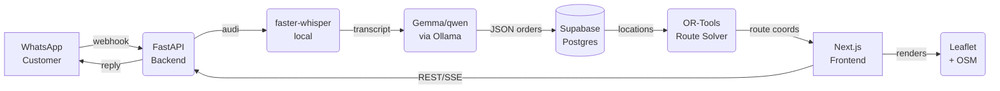
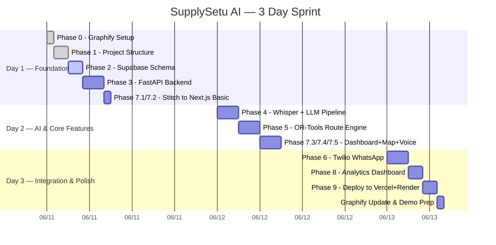

# SupplySetu AI — Comprehensive Phase-wise Implementation Plan

> **Project:** SupplySetu AI — WhatsApp-native Autonomous Logistics Assistant for Indian Informal Vendors  
> **Stack:** Next.js 14 (App Router) · FastAPI · Supabase (Postgres) · faster-whisper · OR-Tools · Leaflet · Twilio · Graphify  
> **Timeline:** 3 days (Hackathon MVP)  
> **Author:** AI-Assisted Plan | June 2026

---

## 🗺️ Project Overview

SupplySetu AI solves a **massive real-world problem**: India's ~6 million informal vendors (vegetable sellers, dairy distributors, flower suppliers, kirana operators) manage orders via WhatsApp voice notes and paper notebooks — with zero digital tooling. The system automates the entire order-to-delivery pipeline:

```
Customer WhatsApp voice → Whisper STT → LLM Extraction → DB → OR-Tools Route → Leaflet Map → Mark Delivered
```

### What's Already Done
- ✅ **23 Stitch HTML screens** generated in `stitch_htmls/` covering all major routes
- ✅ **Next.js frontend** scaffolded in `frontend/` with `next.config.ts` rewrite rules
- ✅ **Full documentation** in `docs/`: Architecture, Frontend Design Doc, SA Implementation, Problem Statement
- ✅ **Graphify** installed (`graphifyy` v0.8.13) — knowledge graph generation in progress via local Ollama

### What Needs to Be Built
- 🔲 Next.js pages consuming Stitch HTML screens with real data hooks
- 🔲 FastAPI backend with all endpoints
- 🔲 Supabase schema + migrations
- 🔲 AI pipeline (Whisper → LLM → structured JSON)
- 🔲 OR-Tools route optimizer
- 🔲 Twilio WhatsApp webhook integration
- 🔲 Graphify knowledge graph fully generated and installed
- 🔲 End-to-end wired together and deployed

---

## 📐 Architecture Recap



---

## Phase 0 — Graphify Knowledge Graph Setup 🧠

> **Goal:** Get Graphify fully operational so every future agent/AI session has instant, token-efficient access to the entire codebase structure.

**Status:** Currently running `graphify . --backend ollama --model qwen2.5-coder:7b --token-budget 4096`

### 0.1 — Complete Graph Generation
Once the running background task finishes, `graphify-out/` will contain:
- `graph.json` — full knowledge graph
- `graph.html` — interactive visualization
- `GRAPH_REPORT.md` — high-level summary

### 0.2 — Install Graphify into Antigravity
```bash
graphify antigravity install
```
This writes `.agents/rules` + `.agents/workflows` + a Graphify skill so that every future session in this project automatically loads the knowledge graph context.

### 0.3 — Install into Gemini CLI (bonus)
```bash
graphify gemini install
```

### 0.4 — Verify Graph Quality
```bash
# Check the report
cat graphify-out/GRAPH_REPORT.md

# Query a concept
graphify query "FastAPI order endpoints"

# Trace a path
graphify path "Voice Upload UI" "Supabase orders table"
```

### 0.5 — Watch Mode (ongoing)
```bash
graphify watch . 
```
This keeps the graph updated as you write new code — essential for an AI-assisted hackathon sprint.

---

## Phase 1 — Project Foundation & Monorepo Structure 🏗️

> **Goal:** Rock-solid project scaffold with proper environment configuration, dependency installation, and `.env` setup.

### 1.1 — Monorepo Layout
```
FarAway Hackathon/
├── frontend/                 ← Next.js 14 (App Router) [EXISTS]
│   ├── src/app/              ← Pages to be created
│   ├── public/screens/       ← Stitch HTMLs to be copied here
│   └── next.config.ts        ← Rewrite rules [EXISTS]
├── backend/                  ← FastAPI [TO CREATE]
│   ├── main.py
│   ├── routers/
│   │   ├── orders.py
│   │   ├── customers.py
│   │   ├── route.py
│   │   ├── transcribe.py
│   │   └── whatsapp.py
│   ├── services/
│   │   ├── whisper_service.py
│   │   ├── llm_service.py
│   │   ├── route_optimizer.py
│   │   └── geocoder.py
│   ├── models/
│   │   └── schemas.py
│   ├── db/
│   │   └── supabase_client.py
│   └── requirements.txt
├── docs/                     ← Architecture docs [EXISTS]
├── stitch_htmls/             ← Raw Stitch outputs [EXISTS, 23 files]
├── graphify-out/             ← Knowledge graph [GENERATING]
└── .env                      ← Shared secrets
```

### 1.2 — Frontend Dependencies
```bash
cd frontend
npm install lucide-react react-leaflet leaflet recharts @supabase/supabase-js
npm install --save-dev @types/leaflet
```

### 1.3 — Backend Setup
```bash
cd backend
python -m venv venv
pip install fastapi uvicorn python-multipart supabase faster-whisper \
            ortools geopy httpx twilio python-dotenv pydantic
pip freeze > requirements.txt
```

### 1.4 — Copy Stitch Screens to Public
```bash
# Copy all Stitch HTMLs to Next.js public/screens
cp stitch_htmls/*.html frontend/public/screens/
```
Rename files to lowercase with hyphens to match `next.config.ts` rewrite destinations:
```
Animated_SVG.html                                → public/screens/animated_svg.html
SupplySetu_AI_-_Landing_Page.html                → public/screens/supplysetu_ai_-_landing_page.html
SupplySetu_AI_-_Login_-_OTP.html                 → public/screens/supplysetu_ai_-_login_-_otp.html
SupplySetu_AI_-_Unified_Vendor_Dashboard.html    → public/screens/supplysetu_ai_-_unified_vendor_dashboard.html
SupplySetu_AI_-_Route_Optimization.html          → public/screens/supplysetu_ai_-_route_optimization.html
SupplySetu_AI_-_Orders_List.html                 → public/screens/supplysetu_ai_-_orders_list.html
SupplySetu_AI_-_New_Order_(Voice).html           → public/screens/supplysetu_ai_-_new_order_voice.html
SupplySetu_AI_-_Customer_Directory.html          → public/screens/supplysetu_ai_-_customer_directory.html
SupplySetu_AI_-_Customer_Profile.html            → public/screens/supplysetu_ai_-_customer_profile.html
SupplySetu_AI_-_Analytics_Dashboard.html         → public/screens/supplysetu_ai_-_analytics_dashboard.html
SupplySetu_AI_-_Settings.html                    → public/screens/supplysetu_ai_-_settings.html
```

### 1.5 — Environment Variables
Create `.env` in project root:
```env
# Supabase
NEXT_PUBLIC_SUPABASE_URL=https://xxx.supabase.co
NEXT_PUBLIC_SUPABASE_ANON_KEY=eyJ...
SUPABASE_SERVICE_ROLE_KEY=eyJ...

# Twilio (WhatsApp Sandbox)
TWILIO_ACCOUNT_SID=ACxxxx
TWILIO_AUTH_TOKEN=xxxxx
TWILIO_WHATSAPP_FROM=whatsapp:+14155238886

# Backend
BACKEND_URL=http://localhost:8000
NEXT_PUBLIC_BACKEND_URL=http://localhost:8000

# LLM (Ollama local)
OLLAMA_BASE_URL=http://localhost:11434
OLLAMA_MODEL=qwen2.5-coder:7b

# Graphify
GRAPHIFY_OLLAMA_NUM_CTX=8192
```

---

## Phase 2 — Supabase Database Schema 🗄️

> **Goal:** Create the full relational schema in Supabase Postgres with all required tables, indexes, and Row Level Security.

### 2.1 — Core Schema (run in Supabase SQL Editor)

```sql
-- Enable UUID extension
CREATE EXTENSION IF NOT EXISTS "uuid-ossp";

-- CUSTOMERS table
CREATE TABLE customers (
  id          UUID PRIMARY KEY DEFAULT uuid_generate_v4(),
  name        TEXT NOT NULL,
  phone       TEXT UNIQUE,
  address     TEXT,
  lat         FLOAT,
  lng         FLOAT,
  tags        TEXT[],
  notes       TEXT,
  created_at  TIMESTAMPTZ DEFAULT NOW()
);

-- ORDERS table
CREATE TABLE orders (
  id              UUID PRIMARY KEY DEFAULT uuid_generate_v4(),
  customer_id     UUID REFERENCES customers(id) ON DELETE CASCADE,
  customer_name   TEXT,  -- denormalized for speed
  status          TEXT DEFAULT 'pending' CHECK (status IN ('pending','in_transit','delivered','cancelled')),
  source          TEXT DEFAULT 'manual' CHECK (source IN ('whatsapp_voice','whatsapp_text','manual')),
  scheduled_date  DATE DEFAULT CURRENT_DATE,
  raw_transcript  TEXT,
  notes           TEXT,
  created_at      TIMESTAMPTZ DEFAULT NOW(),
  updated_at      TIMESTAMPTZ DEFAULT NOW()
);

-- ORDER ITEMS table
CREATE TABLE order_items (
  id           UUID PRIMARY KEY DEFAULT uuid_generate_v4(),
  order_id     UUID REFERENCES orders(id) ON DELETE CASCADE,
  product_name TEXT NOT NULL,
  quantity     NUMERIC NOT NULL,
  unit         TEXT DEFAULT 'kg',
  created_at   TIMESTAMPTZ DEFAULT NOW()
);

-- DELIVERIES table (route batches)
CREATE TABLE deliveries (
  id          UUID PRIMARY KEY DEFAULT uuid_generate_v4(),
  order_ids   UUID[],
  route       JSONB,           -- [{lat, lng, customer, order_id}]
  distance_km FLOAT,
  est_minutes INT,
  status      TEXT DEFAULT 'assigned' CHECK (status IN ('assigned','en_route','completed')),
  created_at  TIMESTAMPTZ DEFAULT NOW()
);

-- MESSAGES table (WhatsApp chat log)
CREATE TABLE messages (
  id          UUID PRIMARY KEY DEFAULT uuid_generate_v4(),
  direction   TEXT CHECK (direction IN ('inbound','outbound')),
  from_number TEXT,
  to_number   TEXT,
  body        TEXT,
  media_url   TEXT,
  order_id    UUID REFERENCES orders(id),
  created_at  TIMESTAMPTZ DEFAULT NOW()
);

-- Indexes for performance
CREATE INDEX idx_orders_status ON orders(status);
CREATE INDEX idx_orders_date ON orders(scheduled_date);
CREATE INDEX idx_order_items_order ON order_items(order_id);
CREATE INDEX idx_customers_phone ON customers(phone);

-- Updated_at trigger
CREATE OR REPLACE FUNCTION update_updated_at()
RETURNS TRIGGER AS $$
BEGIN NEW.updated_at = NOW(); RETURN NEW; END;
$$ LANGUAGE plpgsql;

CREATE TRIGGER orders_updated_at
  BEFORE UPDATE ON orders
  FOR EACH ROW EXECUTE FUNCTION update_updated_at();

-- Enable Realtime on orders table
ALTER PUBLICATION supabase_realtime ADD TABLE orders;
```

### 2.2 — Seed Mock Data
Seed 5 customers and ~10 orders with mixed statuses so the frontend screens work immediately from Day 1:
```sql
INSERT INTO customers (name, phone, address, lat, lng) VALUES
  ('ABC Stores',     '+919876543210', 'Dadar West Market, Mumbai',   19.0178, 72.8478),
  ('Sharma Kirana',  '+919876543211', 'Worli Village, Mumbai',        19.0148, 72.8184),
  ('Hotel Sai Ram',  '+919876543212', 'Dharavi Main Road, Mumbai',    19.0432, 72.8556),
  ('Mehta Grocers',  '+919876543213', 'Mahim Causeway, Mumbai',       19.0396, 72.8419),
  ('Green Leaf Deli','+919876543214', 'Bandra West, Mumbai',          19.0596, 72.8295);
```

---

## Phase 3 — FastAPI Backend 🐍

> **Goal:** Build the complete REST API that orchestrates all AI components, exposes data to the frontend, and receives Twilio webhooks.

### 3.1 — `backend/main.py`
```python
from fastapi import FastAPI
from fastapi.middleware.cors import CORSMiddleware
from routers import orders, customers, route, transcribe, whatsapp

app = FastAPI(title="SupplySetu AI API", version="1.0")

app.add_middleware(CORSMiddleware, allow_origins=["*"], 
                   allow_methods=["*"], allow_headers=["*"])

app.include_router(orders.router,     prefix="/api/orders",     tags=["Orders"])
app.include_router(customers.router,  prefix="/api/customers",  tags=["Customers"])
app.include_router(route.router,      prefix="/api/route",      tags=["Route"])
app.include_router(transcribe.router, prefix="/api/transcribe", tags=["Transcribe"])
app.include_router(whatsapp.router,   prefix="/api/whatsapp",   tags=["WhatsApp"])

@app.get("/health")
def health(): return {"status": "ok"}
```

### 3.2 — All API Endpoints

| Method | Endpoint | Description |
|--------|----------|-------------|
| `GET` | `/api/orders` | List orders (filter by date, status) |
| `POST` | `/api/orders` | Create order manually |
| `GET` | `/api/orders/{id}` | Single order detail |
| `PUT` | `/api/orders/{id}` | Update order status |
| `DELETE` | `/api/orders/{id}` | Delete order |
| `GET` | `/api/customers` | List customers |
| `POST` | `/api/customers` | Create customer |
| `GET` | `/api/customers/{id}` | Customer profile |
| `POST` | `/api/transcribe` | Upload audio → transcribed text |
| `POST` | `/api/transcribe/extract` | Transcript → structured JSON |
| `POST` | `/api/route` | Compute optimized route for order IDs |
| `POST` | `/api/whatsapp` | Twilio webhook receiver |
| `GET` | `/api/analytics/summary` | Dashboard KPIs |

### 3.3 — Pydantic Schemas (`backend/models/schemas.py`)
```python
from pydantic import BaseModel
from typing import List, Optional
from datetime import date
import uuid

class OrderItem(BaseModel):
    product_name: str
    quantity: float
    unit: str = "kg"

class OrderCreate(BaseModel):
    customer_id: Optional[uuid.UUID]
    customer_name: str
    items: List[OrderItem]
    scheduled_date: date
    source: str = "manual"
    notes: Optional[str]

class RouteRequest(BaseModel):
    order_ids: List[uuid.UUID]
    depot: dict  # {lat, lng}

class TranscribeResponse(BaseModel):
    transcript: str
    language: str
    duration_seconds: float

class ExtractResponse(BaseModel):
    customer: str
    items: List[OrderItem]
    delivery_date: Optional[str]
    confidence: float
```

### 3.4 — Supabase Client (`backend/db/supabase_client.py`)
```python
import os
from supabase import create_client, Client

url = os.environ["NEXT_PUBLIC_SUPABASE_URL"]
key = os.environ["SUPABASE_SERVICE_ROLE_KEY"]
supabase: Client = create_client(url, key)
```

---

## Phase 4 — AI Pipeline 🤖

> **Goal:** Wire together faster-whisper (STT) and local LLM (via Ollama) to form the complete voice-to-order extraction pipeline.

### 4.1 — Whisper Transcription Service (`backend/services/whisper_service.py`)
```python
from faster_whisper import WhisperModel

# Load once at startup (base model: 140MB, fast on CPU)
_model = WhisperModel("base", device="cpu", compute_type="int8")

def transcribe_audio(file_path: str) -> dict:
    segments, info = _model.transcribe(file_path, beam_size=5)
    transcript = " ".join(seg.text for seg in segments)
    return {
        "transcript": transcript.strip(),
        "language": info.language,
        "duration_seconds": info.duration
    }
```

**Supported languages:** Hindi (`hi`), Marathi (`mr`), English (`en`), Hinglish auto-detected.

### 4.2 — LLM Order Extraction (`backend/services/llm_service.py`)
```python
import httpx, json, os

OLLAMA_URL = os.getenv("OLLAMA_BASE_URL", "http://localhost:11434")
MODEL = os.getenv("OLLAMA_MODEL", "llama3.2:3b")

EXTRACT_PROMPT = """
You are an order extraction assistant for an Indian vegetable vendor.
Given a transcription of a customer's order (may be in Hindi, Marathi, English, or Hinglish),
extract the structured data and return ONLY valid JSON in this exact format:

{
  "customer": "<customer name or 'Unknown'>",
  "items": [
    {"product_name": "<item>", "quantity": <number>, "unit": "<kg|piece|dozen|litre>"}
  ],
  "delivery_date": "<YYYY-MM-DD or null>",
  "confidence": <0.0-1.0>
}

Transcript: {transcript}
"""

async def extract_order(transcript: str) -> dict:
    prompt = EXTRACT_PROMPT.format(transcript=transcript)
    async with httpx.AsyncClient(timeout=60) as client:
        resp = await client.post(f"{OLLAMA_URL}/api/generate", json={
            "model": MODEL,
            "prompt": prompt,
            "stream": False,
            "format": "json"
        })
    return json.loads(resp.json()["response"])
```

### 4.3 — Transcribe Router (`backend/routers/transcribe.py`)
```python
import shutil, tempfile
from fastapi import APIRouter, UploadFile, File, HTTPException
from services.whisper_service import transcribe_audio
from services.llm_service import extract_order

router = APIRouter()

@router.post("/")
async def transcribe(file: UploadFile = File(...)):
    # Save uploaded audio to temp file
    suffix = "." + file.filename.split(".")[-1]
    with tempfile.NamedTemporaryFile(delete=False, suffix=suffix) as tmp:
        shutil.copyfileobj(file.file, tmp)
        tmp_path = tmp.name
    
    result = transcribe_audio(tmp_path)
    return result

@router.post("/extract")
async def extract(body: dict):
    transcript = body.get("transcript", "")
    if not transcript:
        raise HTTPException(400, "No transcript provided")
    result = await extract_order(transcript)
    return result
```

### 4.4 — Full Pipeline Test
```bash
# Test voice upload end-to-end
curl -X POST http://localhost:8000/api/transcribe \
  -F "file=@test_order.ogg"

# Then extract structured data
curl -X POST http://localhost:8000/api/transcribe/extract \
  -H "Content-Type: application/json" \
  -d '{"transcript":"Kal subah 20 kilo tamatar aur 15 kilo pyaz bhejna"}'

# Expected output:
# {"customer":"Unknown","items":[{"product_name":"Tomato","quantity":20,"unit":"kg"},
#  {"product_name":"Onion","quantity":15,"unit":"kg"}],"delivery_date":null,"confidence":0.9}
```

---

## Phase 5 — Route Optimization Engine 🗺️

> **Goal:** Build the OR-Tools VRP solver that takes pending order locations and returns an optimized delivery sequence.

### 5.1 — Geocoding Service (`backend/services/geocoder.py`)
```python
from geopy.geocoders import Nominatim
from geopy.distance import geodesic

geolocator = Nominatim(user_agent="supplysetu-ai")

def geocode_address(address: str) -> dict:
    location = geolocator.geocode(address + ", Mumbai, India")
    if location:
        return {"lat": location.latitude, "lng": location.longitude}
    return None

def build_distance_matrix(locations: list) -> list:
    """locations = [{"lat": x, "lng": y}, ...]"""
    n = len(locations)
    matrix = [[0]*n for _ in range(n)]
    for i in range(n):
        for j in range(n):
            if i != j:
                dist = geodesic(
                    (locations[i]["lat"], locations[i]["lng"]),
                    (locations[j]["lat"], locations[j]["lng"])
                ).meters
                matrix[i][j] = int(dist)
    return matrix
```

### 5.2 — OR-Tools Route Optimizer (`backend/services/route_optimizer.py`)
```python
from ortools.constraint_solver import routing_enums_pb2, pywrapcp

def solve_tsp(distance_matrix: list) -> dict:
    """
    Solves Travelling Salesman Problem using OR-Tools.
    Returns: {"route_indices": [0,2,1,3,0], "total_distance_m": 12345}
    """
    n = len(distance_matrix)
    manager = pywrapcp.RoutingIndexManager(n, 1, 0)  # n nodes, 1 vehicle, depot=0
    routing = pywrapcp.RoutingModel(manager)

    def distance_callback(from_idx, to_idx):
        return distance_matrix[manager.IndexToNode(from_idx)][manager.IndexToNode(to_idx)]

    transit_callback_idx = routing.RegisterTransitCallback(distance_callback)
    routing.SetArcCostEvaluatorOfAllVehicles(transit_callback_idx)

    search_params = pywrapcp.DefaultRoutingSearchParameters()
    search_params.first_solution_strategy = (
        routing_enums_pb2.FirstSolutionStrategy.PATH_CHEAPEST_ARC)
    search_params.local_search_metaheuristic = (
        routing_enums_pb2.LocalSearchMetaheuristic.GUIDED_LOCAL_SEARCH)
    search_params.time_limit.seconds = 5

    solution = routing.SolveWithParameters(search_params)
    if not solution:
        return {"route_indices": list(range(n)) + [0], "total_distance_m": 0}

    route = []
    total_dist = 0
    index = routing.Start(0)
    while not routing.IsEnd(index):
        route.append(manager.IndexToNode(index))
        prev_idx = index
        index = solution.Value(routing.NextVar(index))
        total_dist += routing.GetArcCostForVehicle(prev_idx, index, 0)
    route.append(0)  # return to depot

    return {"route_indices": route, "total_distance_m": total_dist}
```

### 5.3 — Route Router (`backend/routers/route.py`)
```python
from fastapi import APIRouter
from models.schemas import RouteRequest
from db.supabase_client import supabase
from services.geocoder import build_distance_matrix
from services.route_optimizer import solve_tsp

router = APIRouter()

@router.post("/")
async def compute_route(req: RouteRequest):
    # 1. Fetch customer locations for each order
    locations = [req.depot]  # index 0 = depot
    order_meta = []

    for oid in req.order_ids:
        order = supabase.table("orders").select("*, customers(lat, lng, name)").eq("id", str(oid)).single().execute()
        data = order.data
        lat = data["customers"]["lat"]
        lng = data["customers"]["lng"]
        locations.append({"lat": lat, "lng": lng})
        order_meta.append({"order_id": str(oid), "customer": data["customer_name"], "lat": lat, "lng": lng})

    # 2. Build distance matrix and solve
    matrix = build_distance_matrix(locations)
    result = solve_tsp(matrix)

    # 3. Map route indices back to order metadata
    route_stops = []
    for idx in result["route_indices"]:
        if idx == 0:
            route_stops.append({"type": "depot", **req.depot})
        else:
            stop = order_meta[idx - 1]
            route_stops.append({"type": "stop", **stop})

    distance_km = result["total_distance_m"] / 1000
    est_minutes = int(distance_km / 25 * 60)  # assume 25 km/h avg

    return {
        "route": route_stops,
        "distance_km": round(distance_km, 2),
        "est_minutes": est_minutes,
        "total_stops": len(req.order_ids)
    }
```

---

## Phase 6 — Twilio WhatsApp Integration 📱

> **Goal:** Wire up Twilio's WhatsApp Sandbox webhook so customers can send voice notes or text orders directly via WhatsApp and they flow automatically into the system.

### 6.1 — WhatsApp Router (`backend/routers/whatsapp.py`)
```python
import os, tempfile, shutil, httpx
from fastapi import APIRouter, Form, Response
from twilio.rest import Client as TwilioClient
from services.whisper_service import transcribe_audio
from services.llm_service import extract_order
from db.supabase_client import supabase

router = APIRouter()
twilio = TwilioClient(os.environ["TWILIO_ACCOUNT_SID"], os.environ["TWILIO_AUTH_TOKEN"])

@router.post("/")
async def receive_whatsapp(
    From: str = Form(...),
    Body: str = Form(""),
    NumMedia: int = Form(0),
    MediaUrl0: str = Form(None),
    MediaContentType0: str = Form(None)
):
    phone = From.replace("whatsapp:", "")
    transcript = None

    # Handle voice note
    if NumMedia > 0 and MediaUrl0 and "audio" in (MediaContentType0 or ""):
        async with httpx.AsyncClient() as client:
            audio_resp = await client.get(
                MediaUrl0,
                auth=(os.environ["TWILIO_ACCOUNT_SID"], os.environ["TWILIO_AUTH_TOKEN"])
            )
        with tempfile.NamedTemporaryFile(delete=False, suffix=".ogg") as tmp:
            tmp.write(audio_resp.content)
            tmp_path = tmp.name
        
        result = transcribe_audio(tmp_path)
        transcript = result["transcript"]

    # Use text body if no audio
    elif Body.strip():
        transcript = Body.strip()

    if transcript:
        # Extract order from transcript
        extracted = await extract_order(transcript)

        # Find or create customer
        customer_resp = supabase.table("customers")\
            .select("*").eq("phone", phone).execute()
        
        if customer_resp.data:
            customer = customer_resp.data[0]
        else:
            new_customer = supabase.table("customers")\
                .insert({"name": extracted.get("customer", "Unknown"), "phone": phone})\
                .execute()
            customer = new_customer.data[0]

        # Create order
        order = supabase.table("orders").insert({
            "customer_id": customer["id"],
            "customer_name": customer["name"],
            "status": "pending",
            "source": "whatsapp_voice" if NumMedia > 0 else "whatsapp_text",
            "raw_transcript": transcript
        }).execute().data[0]

        # Insert order items
        items_to_insert = [
            {"order_id": order["id"], **item}
            for item in extracted.get("items", [])
        ]
        supabase.table("order_items").insert(items_to_insert).execute()

        # Reply to customer
        item_summary = ", ".join(
            f"{i['quantity']} {i['unit']} {i['product_name']}"
            for i in extracted.get("items", [])
        )
        reply = f"✅ Order received! Items: {item_summary}. We'll deliver soon. - SupplySetu AI"
        twilio.messages.create(
            body=reply,
            from_=os.environ["TWILIO_WHATSAPP_FROM"],
            to=From
        )

    return Response(content="", media_type="text/xml")
```

### 6.2 — Local Webhook Testing with ngrok
```bash
# Terminal 1: Start FastAPI
cd backend && uvicorn main:app --reload --port 8000

# Terminal 2: Expose to internet for Twilio
ngrok http 8000
# Copy ngrok URL → Twilio Console → WhatsApp Sandbox webhook
# Set to: https://xxxx.ngrok.io/api/whatsapp
```

### 6.3 — Twilio Sandbox Setup Steps
1. Go to [Twilio Console](https://console.twilio.com) → Messaging → Try it Out → Send a WhatsApp message
2. Scan QR code or send join code on WhatsApp (+1 415 523 8886)
3. Set sandbox webhook to your ngrok URL + `/api/whatsapp`
4. Test by sending a voice note

---

## Phase 7 — Next.js Frontend Integration 🖥️

> **Goal:** Integrate the 23 Stitch-generated HTML screens into the Next.js App Router, wire them to live backend data via API calls, and add real-time order updates via Supabase Realtime.

### 7.1 — Stitch HTML Integration Strategy

The 23 screens in `stitch_htmls/` are standalone HTML files. Two options exist:

**Strategy A — Direct Static Serving (Fast, for Demo):**  
Copy HTMLs to `public/screens/` and serve via `next.config.ts` rewrites *(already configured)*.  
- **Pros:** Zero conversion work, screens display instantly  
- **Cons:** No real data binding, purely visual  

**Strategy B — Component Conversion (Production Quality):**  
Convert Stitch HTML to React components in `src/app/` pages.  
- **Pros:** Full data binding, interactivity, Supabase Realtime  
- **Cons:** More work  

**Plan:** Start with Strategy A for the demo, then wire Strategy B for the 3 most critical screens (Dashboard, Route Map, New Order) using Supabase client on the frontend.

### 7.2 — Supabase Client Setup
```typescript
// frontend/src/lib/supabase.ts
import { createClient } from '@supabase/supabase-js'

export const supabase = createClient(
  process.env.NEXT_PUBLIC_SUPABASE_URL!,
  process.env.NEXT_PUBLIC_SUPABASE_ANON_KEY!
)
```

### 7.3 — Dashboard Page with Live Data
**File:** `frontend/src/app/dashboard/page.tsx`

Key live data hooks:
```typescript
// Real-time order subscription
useEffect(() => {
  const channel = supabase
    .channel('orders-realtime')
    .on('postgres_changes', 
        { event: '*', schema: 'public', table: 'orders' },
        (payload) => { /* refresh orders */ })
    .subscribe()
  return () => supabase.removeChannel(channel)
}, [])

// Fetch KPI summary
const { data: kpis } = await fetch(`${BACKEND_URL}/api/analytics/summary`)
```

### 7.4 — Voice Upload Page with Pipeline
**File:** `frontend/src/app/orders/new/page.tsx`

State machine for the 4-step pipeline:
```
idle → uploading → transcribing → extracting → review
```
```typescript
const handleFileUpload = async (file: File) => {
  setStep('uploading')
  
  const form = new FormData()
  form.append('file', file)
  
  // Step 1: Transcribe
  setStep('transcribing')
  const { transcript, language } = await fetch('/api/transcribe', {
    method: 'POST', body: form
  }).then(r => r.json())
  
  // Step 2: Extract order
  setStep('extracting')
  const extracted = await fetch('/api/transcribe/extract', {
    method: 'POST',
    body: JSON.stringify({ transcript }),
    headers: { 'Content-Type': 'application/json' }
  }).then(r => r.json())
  
  setExtractedOrder(extracted)
  setStep('review')
}
```

### 7.5 — Route Map Page (Leaflet)
**File:** `frontend/src/app/route/page.tsx`

```typescript
import { MapContainer, TileLayer, Marker, Polyline, Popup } from 'react-leaflet'

// Fetch optimized route from backend
const handleGenerateRoute = async () => {
  const orderIds = pendingOrders.map(o => o.id)
  const result = await fetch('/api/route', {
    method: 'POST',
    body: JSON.stringify({ order_ids: orderIds, depot: DEPOT_COORDS }),
    headers: { 'Content-Type': 'application/json' }
  }).then(r => r.json())
  
  setRoute(result.route)
  setStats({ km: result.distance_km, mins: result.est_minutes })
}

// Render
<MapContainer center={[19.0178, 72.8478]} zoom={13}>
  <TileLayer url="https://{s}.tile.openstreetmap.org/{z}/{x}/{y}.png" />
  {route.map((stop, i) => <Marker key={i} position={[stop.lat, stop.lng]} />)}
  <Polyline positions={route.map(s => [s.lat, s.lng])} color="#1A6B3C" />
</MapContainer>
```

### 7.6 — Dark Mode Support
Per Frontend Design Doc, implement via CSS variables in `globals.css`:
```css
:root {
  --color-bg: #F4F6F8;
  --color-surface: #FFFFFF;
  /* ... all tokens from design doc ... */
}
@media (prefers-color-scheme: dark) {
  :root {
    --color-bg: #0D1117;
    --color-surface: #161B22;
  }
}
```

### 7.7 — Google Fonts Setup
```typescript
// frontend/src/app/layout.tsx
import { Noto_Sans, Inter, JetBrains_Mono } from 'next/font/google'
const notoSans = Noto_Sans({ subsets: ['latin', 'devanagari'], weight: ['400','500','600','700'] })
const inter = Inter({ subsets: ['latin'] })
```

---

## Phase 8 — Analytics & Observability 📊

> **Goal:** Build the analytics summary endpoint and wire the Recharts-based analytics dashboard.

### 8.1 — Analytics Endpoint (`backend/routers/analytics.py`)
```python
@router.get("/summary")
async def get_summary(date: str = None):
    target = date or str(datetime.today().date())
    
    orders = supabase.table("orders")\
        .select("*, order_items(*)")\
        .eq("scheduled_date", target).execute().data

    total = len(orders)
    pending = sum(1 for o in orders if o["status"] == "pending")
    delivered = sum(1 for o in orders if o["status"] == "delivered")
    in_transit = sum(1 for o in orders if o["status"] == "in_transit")

    # Top products
    product_counts = {}
    for order in orders:
        for item in order.get("order_items", []):
            product_counts[item["product_name"]] = \
                product_counts.get(item["product_name"], 0) + item["quantity"]

    top_products = sorted(product_counts.items(), key=lambda x: -x[1])[:5]

    return {
        "date": target,
        "total_orders": total,
        "pending": pending,
        "delivered": delivered,
        "in_transit": in_transit,
        "completion_rate": round(delivered / total * 100, 1) if total else 0,
        "top_products": [{"name": p, "qty": q} for p, q in top_products]
    }
```

### 8.2 — Demand Forecasting (Stretch)
Simple 7-day rolling average per product:
```python
@router.get("/forecast")
async def get_forecast():
    # Query last 7 days
    seven_days_ago = (datetime.today() - timedelta(days=7)).date()
    items = supabase.table("order_items")\
        .select("product_name, quantity, orders(scheduled_date)")\
        .gte("orders.scheduled_date", str(seven_days_ago)).execute().data
    
    # Compute daily averages
    product_totals = {}
    for item in items:
        p = item["product_name"]
        product_totals[p] = product_totals.get(p, 0) + item["quantity"]
    
    return {"forecast": {p: round(q/7, 1) for p, q in product_totals.items()}}
```

---

## Phase 9 — Deployment & Production Readiness 🚀

> **Goal:** Deploy frontend to Vercel, backend to Render, database on Supabase cloud — all on free tiers.

### 9.1 — Frontend Deployment (Vercel)
```bash
cd frontend
npm run build  # verify build succeeds locally first
vercel --prod
```
Set environment variables in Vercel dashboard:
- `NEXT_PUBLIC_SUPABASE_URL`
- `NEXT_PUBLIC_SUPABASE_ANON_KEY`
- `NEXT_PUBLIC_BACKEND_URL` → Render backend URL

### 9.2 — Backend Deployment (Render)
1. Create `render.yaml` in `backend/`:
```yaml
services:
  - type: web
    name: supplysetu-backend
    env: python
    buildCommand: pip install -r requirements.txt
    startCommand: uvicorn main:app --host 0.0.0.0 --port $PORT
    envVars:
      - key: NEXT_PUBLIC_SUPABASE_URL
        sync: false
      - key: SUPABASE_SERVICE_ROLE_KEY
        sync: false
      - key: TWILIO_ACCOUNT_SID
        sync: false
      - key: TWILIO_AUTH_TOKEN
        sync: false
```

> [!WARNING]
> Render free tier **spins down** after 15 min inactivity. Use Render's "keep-alive" cron or upgrade to starter plan if doing a live demo.

### 9.3 — Supabase Production Migration
```bash
# Use Supabase CLI
npx supabase db push
```

### 9.4 — Twilio Production Webhook Update
Point Twilio sandbox webhook to: `https://supplysetu-backend.onrender.com/api/whatsapp`

### 9.5 — Final Health Check
```bash
curl https://supplysetu-backend.onrender.com/health
# → {"status": "ok"}

curl https://supplysetu-ai.vercel.app/
# → Landing page loads
```

---

## 🔁 Graphify Ongoing Workflow

After every major coding session, update the knowledge graph so the AI always has up-to-date context:

```bash
# After adding backend routes
graphify update . --force

# Query specific concepts
graphify query "How does the voice transcription pipeline work?"
graphify path "WhatsApp webhook" "Supabase orders table"
graphify explain "route_optimizer"

# Export architecture visualization
graphify export callflow-html
```

This gives AI assistants (including Antigravity) a persistent, token-efficient map of the entire codebase — meaning every session starts fully aware of the project structure without re-reading files.

---

## 📅 3-Day Sprint Calendar



---

## ✅ Verification Checklist

### Core MVP (Must Pass)
- [ ] Voice OGG upload → transcript text returned < 30s
- [ ] Transcript → JSON order extracted with correct items
- [ ] Order saved to Supabase, appears on dashboard
- [ ] "Generate Route" button → polyline drawn on Leaflet map
- [ ] "Mark Delivered" updates order status in real-time
- [ ] WhatsApp voice note → order saved to DB automatically
- [ ] All 10 routes render correct Stitch HTML screens

### Stretch Goals
- [ ] Analytics dashboard shows 7-day charts via Recharts
- [ ] Demand forecast card shows rolling average
- [ ] Dark mode works correctly
- [ ] Devanagari (Hindi) text renders in Noto Sans
- [ ] Graphify query answers questions about codebase accurately

---

## 🔗 Key File References

| File | Purpose |
|------|---------|
| [Frontend_Design_Doc.md](file:///c:/Users/Aditya%20Rane/Downloads/FarAway%20Hackathon/docs/Frontend_Design_Doc.md) | 11 screens, design tokens, component specs, Stitch prompts |
| [Architecture.md](file:///c:/Users/Aditya%20Rane/Downloads/FarAway%20Hackathon/docs/Architecture.md) | High-level architecture, API table, DB schema |
| [SA_Implementation.md](file:///c:/Users/Aditya%20Rane/Downloads/FarAway%20Hackathon/docs/SA_Implementation.md) | Phase breakdown, data models, demo script, risks |
| [PS.md](file:///c:/Users/Aditya%20Rane/Downloads/FarAway%20Hackathon/docs/PS.md) | Problem statement, personas, KPIs, success criteria |
| [next.config.ts](file:///c:/Users/Aditya%20Rane/Downloads/FarAway%20Hackathon/frontend/next.config.ts) | Rewrite rules mapping routes to Stitch HTML files |
| `stitch_htmls/` | 23 pre-generated UI screens ready for integration |
| `graphify-out/` | Knowledge graph (generating via Ollama) |

---

*End of Implementation Plan — SupplySetu AI v1.0 — Ready to Execute!*
